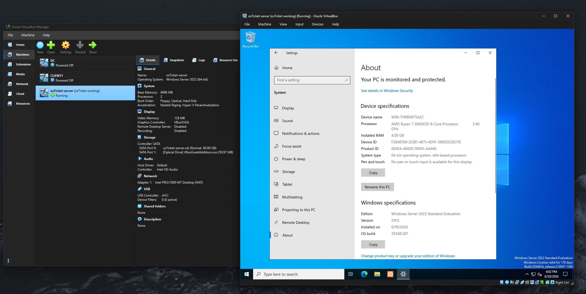
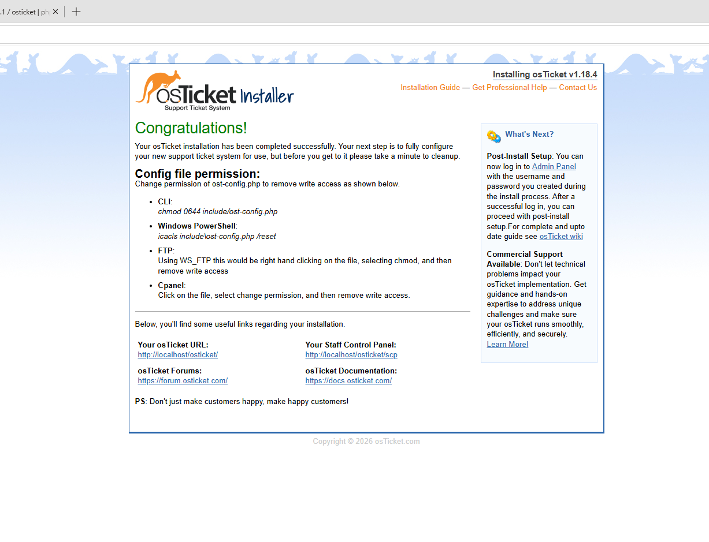
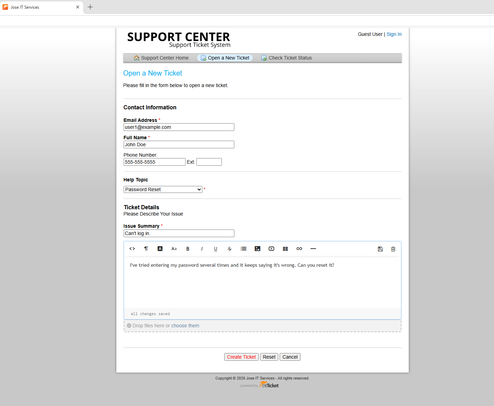
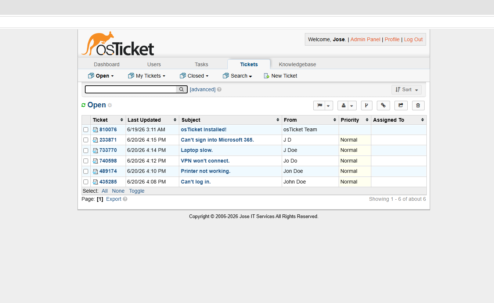
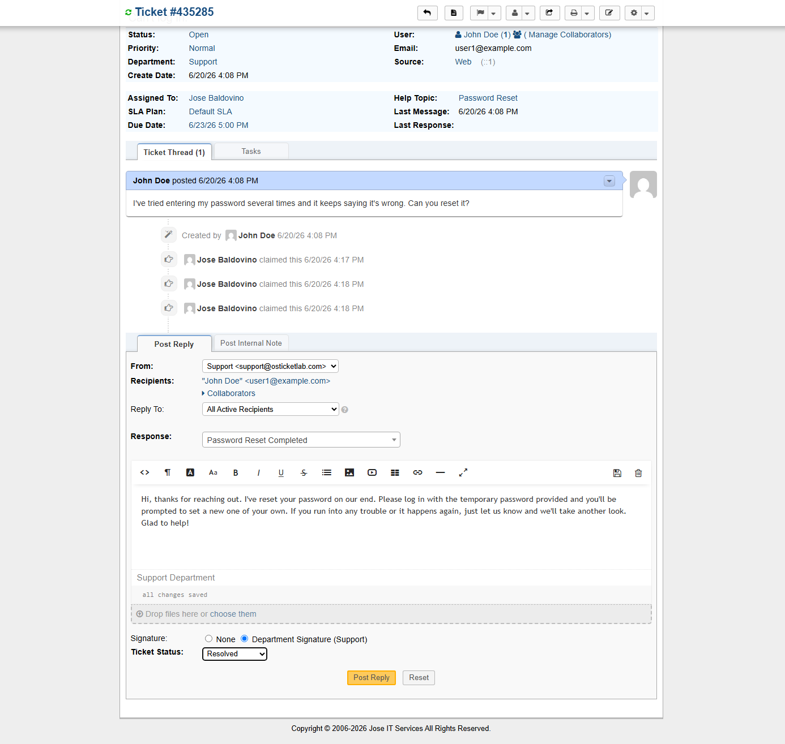
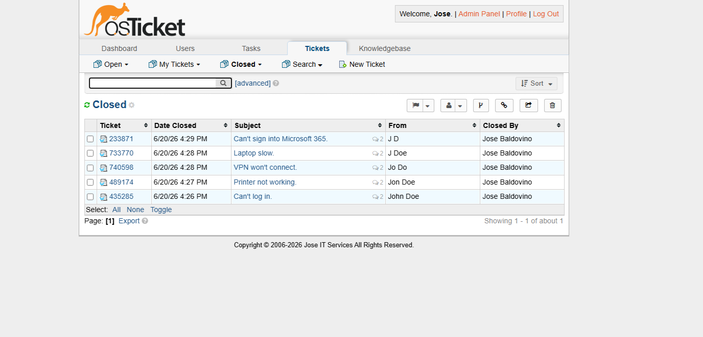
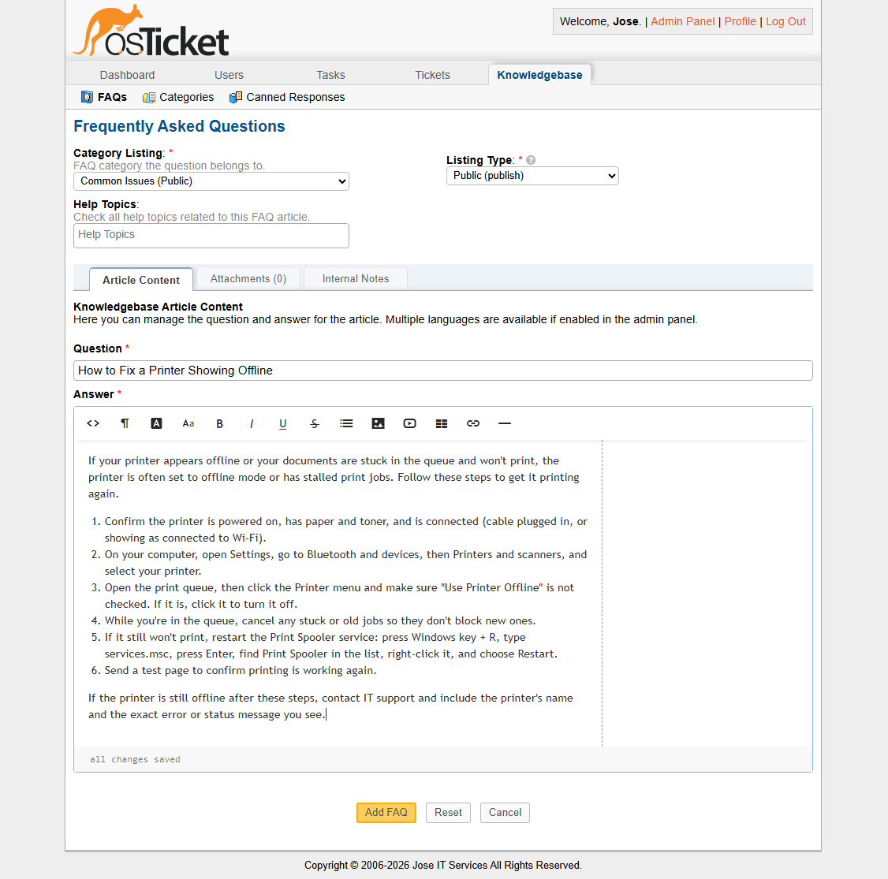

# Help Desk Ticketing System (osTicket on Windows Server VM)

A self-built help desk lab using osTicket, an open-source ticketing platform, deployed on a
Windows Server 2022 virtual machine. Built to practice the end-to-end support workflow used in
entry-level IT help desk and desktop support roles.

## What I Built

- Created an isolated Windows Server 2022 virtual machine in VirtualBox
- Installed and ran a web server stack (Apache, MySQL, PHP) inside the VM using XAMPP
- Created a MySQL database and completed the osTicket web-based installation
- Configured help topics, a canned response, and agent settings to mirror a real support desk
- Opened, worked, and closed sample tickets covering common end-user issues
- Wrote a knowledge base article documenting the fix for a recurring problem
- Applied post-install security steps: removed the setup folder and set the config file to read-only
- Saved a VM snapshot of the working environment

## Skills Practiced

- Building and configuring a virtual machine in VirtualBox
- Setting up a local web server and database (Apache, MySQL, PHP)
- Installing and configuring a web application from start to finish
- Managing the full ticket lifecycle: log, assign, prioritize, document, resolve, and close
- Writing clear internal notes and a customer-facing knowledge base article
- Basic system hardening and VM snapshot management

## Sample Tickets Worked

- Password reset request
- Printer offline / not printing
- VPN will not connect
- Slow laptop performance
- Microsoft 365 login failure

## Screenshots

- Windows Server 2022 VM running in VirtualBox
  
  
- osTicket installation success page
  
  
- Creating ticket as user
  
  
- Staff/agent dashboard
  
  
- Resolving a ticket
  
  
- Closed tickets
  
  
- Creating knowledge base article
  
  

## Tools Used

VirtualBox, Windows Server 2022, osTicket, XAMPP, Apache, MySQL, PHP, phpMyAdmin

## Notes

This lab was built independently to gain hands-on experience with the help desk workflow itself,
from receiving and documenting a request to resolving it and building reusable knowledge base
content, hosted on a self-managed Windows Server virtual machine. These skills map directly to an
IT support or help desk role.
